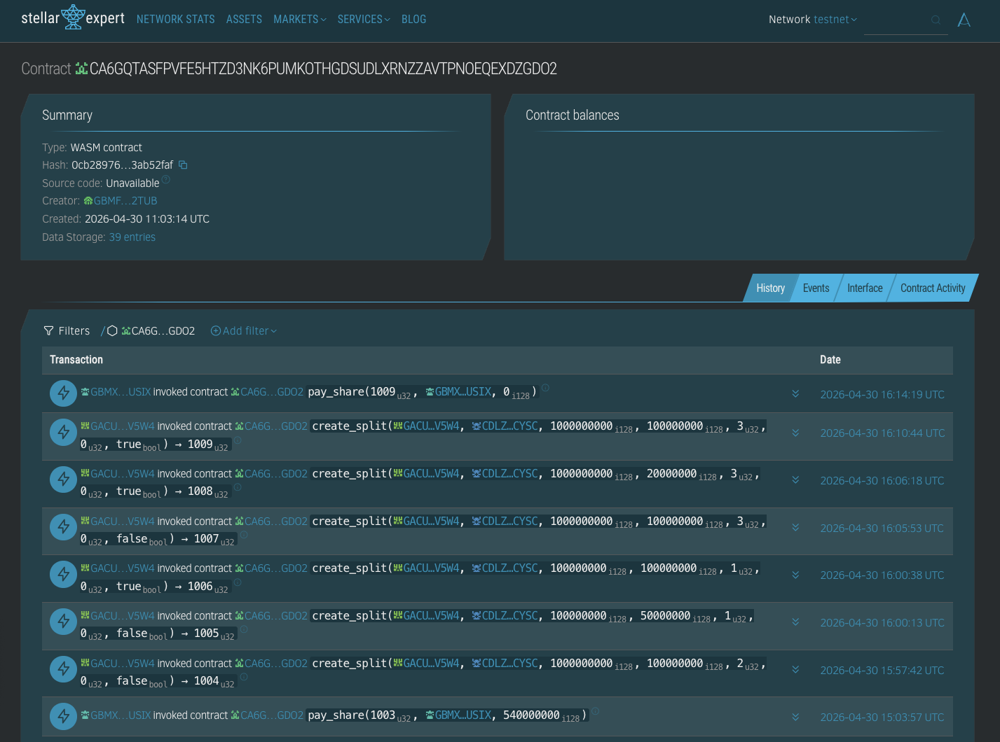
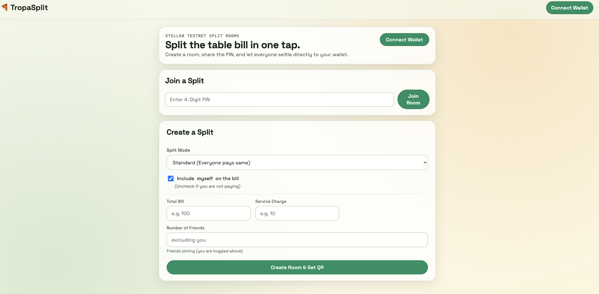

# 🍕 Tropa Split

<!-- [](https://github.com/cassssy/TropaSplit/actions) -->

**Split the table bill in one tap — no math, no IOU chasing.**

---

## Deployment

|                                 | Link                                                                                                                   |
| ------------------------------- | ---------------------------------------------------------------------------------------------------------------------- |
| Smart Contract (Stellar Expert) | [CA6...GDO2](https://stellar.expert/explorer/testnet/contract/CA6GQTASFPVFE5HTZD3NK6PUMKOTHGDSUDLXRNZZAVTPNOEQEXDZGDO2) |
| Token Contract (USDC Testnet)   | [CDL...YSC](https://stellar.expert/explorer/testnet/contract/CDLZFC3SYJYDZT7K67VZ75HPJVIEUVNIXF47ZG2FB2RMQQVU2HHGCYSC) |
| Frontend                        | https://tropa-split.vercel.app/                                                                                        |
| Network                         | Stellar Testnet                                                                                                        |





---

## What It Is

TropaSplit is a decentralized, instant bill-splitting dApp built on Stellar's Soroban platform. It uses a PIN-based lobby system for bill splitting:

1. The payer inputs the **Total Bill**, the **Service Charge**, and the **Party Size**.
2. The smart contract generates a **4-digit PIN** (Room ID) and a **QR code**.
3. Friends scan the QR code at the table or enter the PIN on the website.
4. The contract automatically calculates their exact share and routes the token payment directly to the payer's wallet.

---

## Features

- **Instant Join & Pay:** No manual debt assignment needed. The contract does the math automatically.
- **PIN-Based Lobby Rooms:** Multiple splits are handled simultaneously through unique Room PINs (`split_id`).
- **QR Code Integration:** Mobile-friendly. Friends just scan the code to jump straight to the payment page.
- **Direct Peer-to-Peer Settlement:** The smart contract does not hold funds. Tokens are transferred instantly and directly to the payer.
- **Capacity Enforcement:** The room automatically locks once the target number of people have paid, preventing overpayments.

---

## Tech Stack

| Layer          | Technology                  |
| -------------- | --------------------------- |
| Smart Contract | Rust + Soroban SDK          |
| Blockchain     | Stellar (Testnet)           |
| Frontend       | Vite + React + TypeScript   |
| Wallet         | Freighter Browser Extension |

---

## Architecture

```text
Host (Payer)
    │
    ├── create_split()  ──►  TropaSplit Contract (Soroban)
    │                          │
    ├── gets QR Code & PIN     │
    │                          │
Friends                        │
    │                          │
    └── joinAndPay()    ──►  contract checks:
                                - valid split room
                                - custom or exact amount
                                - friend hasn't paid yet
                                │
                                └── directly transfers tokens to Host
```

---

## Running Locally

### Prerequisites

```bash
# Rust
curl --proto '=https' --tlsv1.2 -sSf https://sh.rustup.rs | sh

rustup target add wasm32-unknown-unknown
cargo install --locked stellar-cli --features opt

# Node.js 18+
```

### Contract

```bash
cd contract

# Build the optimized WASM file
cargo build --target wasm32-unknown-unknown --release

# Deploy to the Stellar Testnet
stellar contract deploy \
  --wasm target/wasm32-unknown-unknown/release/tropa_split.wasm \
  --source default \
  --network testnet
```

_(Save the `CONTRACT_ID` that the terminal prints out!)_

### Frontend

```bash
cd frontend
cp .env.example .env
# fill in VITE_USDC_CONTRACT_ID and VITE_SOROBAN_RPC_URL

npm install
npm run dev
```

Install the [Freighter browser extension](https://freighter.app) and fund your testnet wallet.

### Regenerate contract bindings (after redeployment)

```bash
cd frontend

stellar contract bindings typescript \
  --network testnet \
  --contract-id <YOUR_CONTRACT_ID> \
  --output-dir src/contracts/tropa-split \
  --overwrite

npm run build
```
